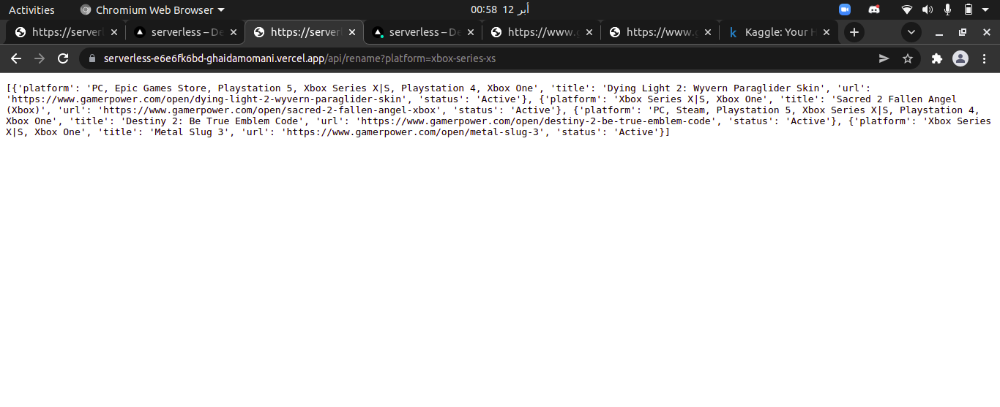

## To see the serverless function :
- First click on this [url]()
- Then type /api/Hi at the end of the url path
- You will see the calendar of this year, plus the datetime and week number/month.

[1st Link](https://serverless-tawny-nine.vercel.app/api/date)
[2nd Link](https://serverless-tawny-nine.vercel.app/api/platform?platform=pc)

As can be seen in the picture below: 

## Web Server Gateway Interface

- You can take the same link 
-  Type /api/Home at the end of the url path 
- You will see some cool stuff i did For the Stretch Goal

(<a href="#top">back to top</a>)

    

Ghaida Al Momani, Software Engineer

Jordan, Amman

  
22, 22 FEB 
