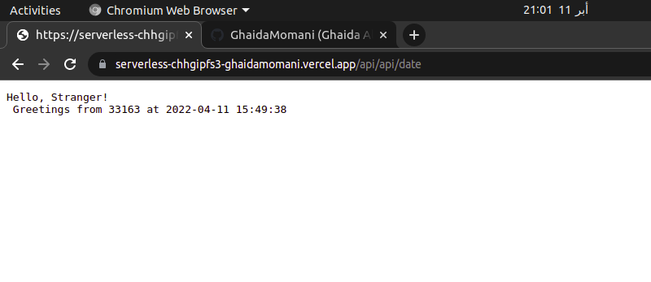
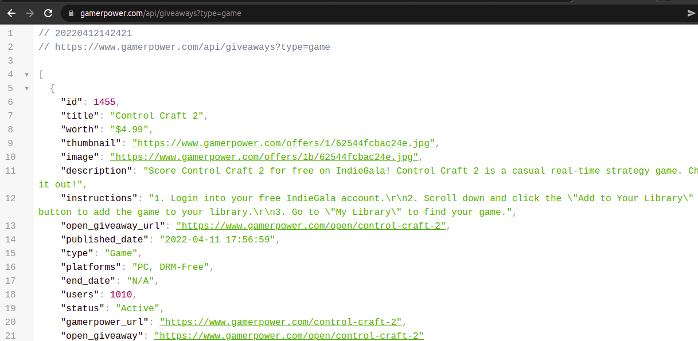

## To see the serverless function :
- check the following URL's
- Then type /api/Hi at the end of the url path
- You will see the calendar of this year, plus the datetime and week number/month.

[1st Link](https://serverless-tawny-nine.vercel.app/api/date)

[2nd Link](https://serverless-tawny-nine.vercel.app/api/type?type=game)

As can be seen in the picture below: 

## Testing it with Insomnia
 

## Web Server Gateway Interface

* type.py   reads a json files form a live api and parse it into my serverless function 
so from here you can  Insert giveaway type, eg: game, loot, beta

you can access other platforms form the [API's url](https://www.gamerpower.com/api-read)

## a glance og our json file 

(<a href="#top">back to top</a>)

    

Ghaida Al Momani, Software Engineer

Jordan, Amman

  
22,12 APR 
